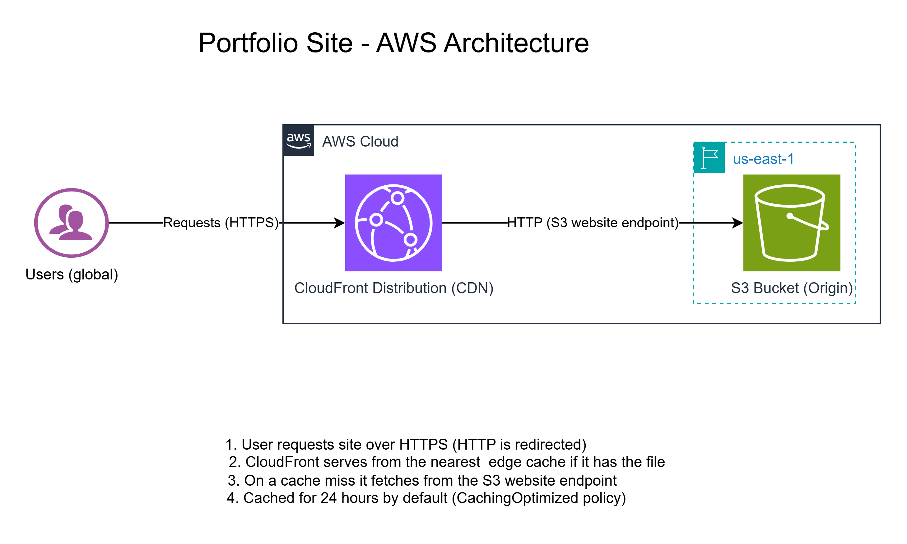

# Portfolio Site on AWS (S3 + CloudFront)

A static portfolio website hosted on **Amazon S3** and delivered globally through **Amazon CloudFront**, deployed and updated from the command line with the AWS CLI.

**Live site:** https://d2tt07sy77xe1b.cloudfront.net/



## Overview

This project was built to practise the core pattern behind a lot of real-world static hosting: keep the files in object storage, put a CDN in front, and serve everything over HTTPS from the edge location closest to the visitor.

## How a request flows

1. A visitor requests the site over HTTPS. Plain HTTP requests are redirected to HTTPS by CloudFront.
2. CloudFront checks the nearest edge location. If the file is cached, it is served straight from there.
3. On a cache miss, CloudFront fetches the file from the S3 static website endpoint.
4. The response is cached for 24 hours by default (the `CachingOptimized` cache policy), so repeat visits never touch S3.

## AWS services used

| Service | Role in this project |
|---|---|
| **S3** | Stores `index.html` and `404.html`, with static website hosting enabled |
| **CloudFront** | CDN in front of the bucket: HTTPS, edge caching, global delivery |
| **IAM** | A dedicated admin user for day-to-day work instead of the root account |

## Configuration summary

- **Bucket:** static website hosting enabled, `index.html` as the index document, `404.html` as the error document
- **Bucket access:** public read through a bucket policy (`s3:GetObject` on the objects only)
- **Origin:** the S3 website endpoint, using HTTP only (S3 website endpoints do not support HTTPS)
- **Viewer protocol policy:** redirect HTTP to HTTPS
- **Allowed methods:** GET, HEAD, OPTIONS
- **Cache policy:** CachingOptimized
- **Default root object:** `index.html`
- **Tags:** `Project`, `Environment`, `Owner`

## Deploying changes

The AWS CLI is configured with an IAM user (never the root account). The `deploy.sh` script syncs the site files to S3 and then invalidates the CloudFront cache so visitors see the update straight away:

```bash
./deploy.sh
```

What it does under the hood:

```bash
aws s3 sync . s3://spencer-portfolio-site --exclude ".git/*" --exclude "*.md" --exclude "*.png"
aws cloudfront create-invalidation --distribution-id <DISTRIBUTION_ID> --paths "/*"
```

You can verify the cache behaviour with:

```bash
curl -sI https://d2tt07sy77xe1b.cloudfront.net | grep -i x-cache
```

`Miss from cloudfront` means the edge fetched from S3. `Hit from cloudfront` means it was served from cache.

## Repository structure

```
portfolio-site/
├── index.html          # the site
├── 404.html            # custom error page
├── deploy.sh           # sync to S3 + CloudFront invalidation
├── portfolio-site-architecture.png  # architecture diagram (draw.io)
└── README.md
```

## Security notes and trade-offs

- The bucket is public through a bucket policy. That is acceptable for a public portfolio, but it means anyone can also read the objects directly from the S3 website URL, bypassing CloudFront.
- The site uses the default `*.cloudfront.net` certificate. There is no custom domain yet.
- No credentials live in this repository. The AWS CLI keeps them in `~/.aws`, outside the project.

## Future improvements

- [ ] Make the bucket private and give CloudFront access through **Origin Access Control (OAC)**
- [ ] Add a custom domain with **Route 53** and an **ACM** certificate
- [ ] Automate deployments with a **GitHub Actions** workflow instead of running `deploy.sh` by hand
- [ ] Define the whole setup as code with **CloudFormation**

## What I learned

- Why a CDN cache needs **invalidation** after you update the origin: S3 had the new file, but CloudFront kept serving the old one
- The difference between the S3 REST endpoint and the **S3 website endpoint**, and why the CloudFront-to-S3 leg is HTTP while visitors still get HTTPS
- How a bucket policy grants public read, and what the trade-off is compared with OAC
- Why day-to-day work belongs on an IAM user, not the root account

## Author

**Spencer Mukui**, Nairobi, Kenya
[LinkedIn](https://linkedin.com/in/spencer-mukui-677b2218a/) | [GitHub](https://github.com/Mukui012)